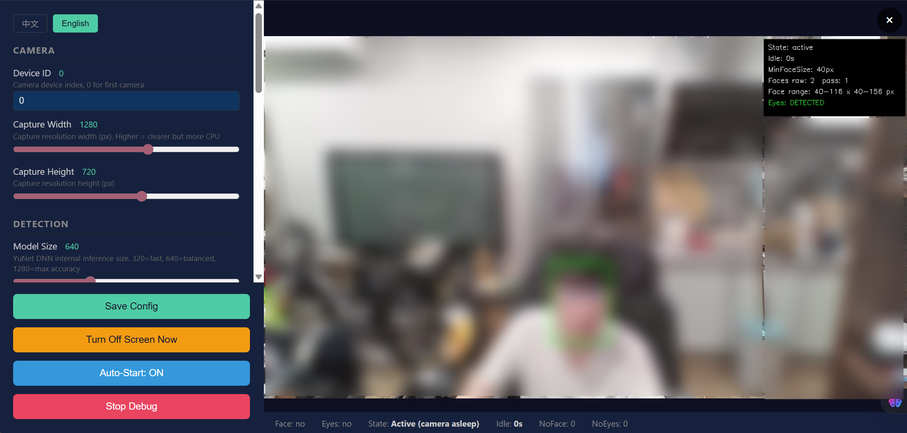

# LGTV OLED Guard

[嶄猟](README.zh.md)

Presence-aware screen saver for LG OLED TVs. Detects whether you are at your desk and automatically turns the display on/off to prevent burn-in and extend panel lifespan.

Runs silently in the system tray on Windows. Uses a webcam + YuNet face detection to know when you are present.

## How It Works

```
Active (no camera) --2 min idle--> Passive (camera on, 2s detection)
                                       |
                         face+eyes found? --yes--> stay on
                                       |
                                      no --> count cycles
                                       |
                              threshold met? --yes--> screen off
                                       |
                        mouse/keyboard move --------> screen on, back to Active
```

- **Active mode**: Camera stays off. Monitors mouse/keyboard activity only. Zero CPU overhead.
- **Passive mode**: After 2 minutes of inactivity, camera activates. YuNet DNN checks every 2 seconds for a face and eyes. Low CPU (~5-10% on modern hardware).
- **Screen off**: If no face (or face-but-no-eyes) for enough cycles, the display turns off via the LG TV companion tool.
- **Wake**: Any mouse movement or key press turns the screen back on instantly.

## Features

- **Zero config needed** ！ works out of the box with defaults tuned for a desktop webcam above a 42" monitor
- **Face size filtering** ！ ignores background faces (posters, photos) smaller than a configurable threshold
- **Dual eye detection** ！ YuNet landmark keypoints + Haar cascade fallback (with and without glasses)
- **Web control panel** ！ `http://127.0.0.1:19999` for live tuning and debug preview
- **System tray icon** ！ silent background operation, right-click for menu
- **Auto-start** ！ optional registry Run key registration
- **i18n** ！ Chinese and English UI
- **MJPEG debug stream** ！ see the camera feed with bounding boxes and detection data in real time

## Screenshot



## Requirements

- Windows 10/11
- A webcam
- [LGTVCompanion](https://github.com/JPersson77/LGTVCompanion) ！ controls the LG TV via Wake-on-LAN / serial commands (or any tool accepting `-screenon` / `-screenoff`)
- OpenCV 4.x with GoCV bindings (for building from source)

## Quick Start

1. Download the latest `gocv.exe` from [Releases](https://github.com/kristax/lgtv-oledguard/releases)
2. Install [LGTVCompanion](https://github.com/JPersson77/LGTVCompanion) or configure your LG TV control CLI
3. Place `face_detection_yunet_2023mar.onnx` in the same directory as the exe
4. Run `gocv.exe` ！ it appears in the system tray
5. Right-click tray icon -> **Open Panel** to configure

## Configuration

All settings are in `config.json` (next to the exe) and can be edited via the web UI:

| Section | Parameter | Default | Description |
|---------|-----------|---------|-------------|
| Camera | Width | 1280 | Capture resolution width |
| Camera | Height | 720 | Capture resolution height |
| Detection | Model Size | 640 | YuNet DNN internal size (320/640/1280) |
| Detection | Score Threshold | 0.5 | Face detection confidence minimum |
| Detection | NMS Threshold | 0.3 | Overlapping box suppression |
| Detection | Min Eye Distance | 15 | Min eye landmark distance (px) |
| Detection | Min Face Size | 40 | Ignore faces smaller than this (px) |
| Timing | Active Timeout | 120s | Idle time before camera activates |
| Timing | Passive Interval | 2s | Detection interval in camera mode |
| Timing | No-Face Cycles | 5 | Consecutive no-face detections to trigger off |
| Timing | No-Eyes Cycles | 15 | Consecutive face-but-no-eyes to trigger off |
| System | Server Port | 19999 | Web UI port |
| System | LGTV Cmd | LGTVcli.exe | Display control command |

## Build from Source

```bash
# Requires Go 1.22+, OpenCV 4.x with GoCV, MinGW
go build -ldflags="-H windowsgui -s -w" -o gocv.exe .
```

The `rsrc.syso` file embeds the tray icon resource. To regenerate it:

```bash
windres resource.rc -o rsrc.syso -O coff -F pe-x86-64
```

## How Detection Works

Uses YuNet face detection with ONNX runtime:

1. **Face**: YuNet DNN scans each frame for faces -- filters out small faces (background posters)
2. **Eyes**: Landmark points for left/right eye -- measures inter-eye distance to confirm eyes visible
3. **Fallback**: If no landmarks, runs Haar cascade (`haarcascade_eye` + `haarcascade_eye_tree_eyeglasses`) on face ROI

The dual-cascade approach handles both glasses-wearers and bare-faced users.

## License

MIT
